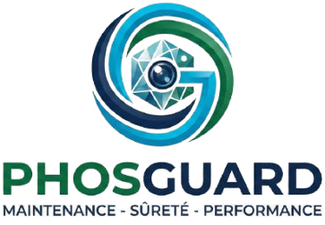

<p align="center">
  
  &nbsp;&nbsp;&nbsp;
  
</p>

<p align="center">⚙️ PhosGuard</p>

### <p align="center"><b>Application de Gestion de Maintenance Industrielle</b></p>

<p align="center">
  
  
  
</p>

<p align="center">
  
  
  
  
  
  
</p>

---

## 📝 Présentation

**PhosGuard** est une application web conçue pour centraliser et digitaliser la gestion de la maintenance industrielle au sein du **Groupe OCP (Office Chérifien des Phosphates)**.

La plateforme permet aux responsables et techniciens de suivre en temps réel l'état des équipements, de gérer les tickets d'intervention, de planifier la maintenance préventive, de piloter le stock de pièces de rechange et de générer automatiquement des rapports et notifications pour les équipes techniques.

> [!NOTE]
> *Ce projet a été réalisé dans le cadre d'un stage au sein du Groupe OCP pour moderniser et digitaliser les flux de maintenance industrielle.*

---

## 🎯 Objectifs du Projet

*   🟢 **Centraliser** la gestion des équipements et des interventions de maintenance.
*   🟢 **Assurer la traçabilité** complète des tickets, de leur création à leur clôture.
*   🟢 **Réduire les délais** de traitement grâce au calcul automatique des indicateurs GTI/GTR.
*   🟢 **Automatiser** la planification des visites de maintenance préventive.
*   🟢 **Optimiser** le stock de pièces de rechange avec alertes de seuil bas.
*   🟢 **Fournir des tableaux de bord** et rapports PDF pour l'aide à la décision.

---

## ✨ Fonctionnalités Principales

### 🔐 Authentification & Sécurité
*   Connexion sécurisée via **Laravel Sanctum** (authentification SPA par cookies).
*   Gestion de session et réinitialisation de mot de passe par email.

### 👥 Gestion des Utilisateurs
*   CRUD complet des comptes utilisateurs.
*   Gestion des rôles : **Admin / Responsable / Technicien**.
*   Activation / désactivation des comptes en un clic.

### ⚙️ Gestion des Équipements
*   Inventaire complet avec statut dynamique (Fonctionnel 🟢 / En panne 🔴).
*   Recherche et filtres avancés.

### 🚨 Tickets d'Intervention
*   Création, affectation à un technicien et suivi de statut en temps réel.
*   Calcul automatique des délais **GTI** (délai d'intervention) et **GTR** (délai de rétablissement) selon la priorité.

### 📅 Maintenance Préventive
*   Planification de visites récurrentes (tous les 15 jours).
*   Checklist technique, compte rendu et renouvellement automatique.

### 📦 Gestion du Stock
*   Inventaire des pièces de rechange avec mouvements entrée/sortie.
*   **Alertes visuelles** de stock bas.
*   Sortie automatique des pièces lors de la clôture d'un ticket.

### 📊 Dashboard & Rapports
*   Statistiques globales et graphiques de répartition (via Recharts).
*   Export PDF des tickets et équipements (via barryvdh/laravel-dompdf).

### 🔔 Notifications
*   Alertes en temps réel pour les événements clés (nouveau ticket, affectation, stock bas).

---

## 📐 Architecture Technique

<p align="center">
   ➔ 
   ➔ 
  
</p>

*   **Frontend** : Single Page Application React 19 + TypeScript, Vite, Tailwind CSS v4, Shadcn UI, Recharts.
*   **Backend** : API REST Laravel 12, authentification Sanctum, architecture en couches (Controllers / Services / Requests / Resources).
*   **Base de Données** : MySQL.
*   **Génération de Rapports** : barryvdh/laravel-dompdf.

---

## 👥 Rôles et Permissions

| Action | Admin | Responsable | Technicien |
|---|:---:|:---:|:---:|
| Gérer les utilisateurs | ✅ | Lecture seule | ❌ |
| Gérer les équipements | ✅ | Lecture seule | Lecture seule |
| Créer un ticket | ✅ | ✅ | ✅ |
| Affecter un ticket | ✅ | ✅ | ❌ |
| Modifier le statut d'un ticket | ✅ | ✅ | Si assigné uniquement |
| Gérer le stock | ✅ | Lecture seule | Lecture seule |
| Générer des rapports | ✅ | ✅ | ❌ |

---

## 📁 Structure du Projet

```text
phosguard/
├── backend/             # API Laravel
│   ├── Http/Controllers # Orchestration légère, délègue aux Services
│   ├── Http/Requests    # Validation des données entrantes
│   ├── Http/Resources   # Formatage des réponses JSON
│   ├── Services         # Logique métier
│   ├── Models           # Eloquent ORM
│   └── Enums            # Valeurs métier fixes (rôles, statuts, priorités)
├── frontend/            # Application React
│   ├── src/
│   │   ├── App.tsx       # Navigation gérée manuellement via useState
│   │   ├── AuthContext   # Authentification centralisée
│   │   └── lib/api.ts    # Client API unique (CSRF + cookies Sanctum)
│   └── public/
└── README.md            # Documentation d'accueil
```

---

## ⚙️ Installation & Lancement

### Prérequis
- PHP 8.2+
- Composer
- Node.js 18+
- MySQL

### 1. Cloner le Dépôt
```bash
git clone <url-du-depot>
cd phosguard
```

### 2. Configurer le Backend
```bash
cd backend
composer install
cp .env.example .env
php artisan key:generate
```

Configurer la base de données dans `.env` :
```
DB_DATABASE=phosguard_db
DB_USERNAME=root
DB_PASSWORD=
```

```bash
php artisan migrate
php artisan serve
```

L'API est accessible sur **`http://localhost:8000`**.

### 3. Configurer le Frontend
```bash
cd ../frontend
npm install
npm run dev
```

L'application est accessible sur **`http://localhost:5173`**.

---

## 📊 Technologies & Outils

| Catégorie | Outils Utilisés |
| :--- | :--- |
| **Frontend** | React 19, TypeScript, Vite, Tailwind CSS v4, Shadcn UI, Recharts |
| **Backend** | Laravel 12, Laravel Sanctum |
| **Base de Données** | MySQL |
| **Génération PDF** | barryvdh/laravel-dompdf |

---

## 🏆 Résultats & Bénéfices

*   🚀 **Productivité accrue** : centralisation de la gestion des équipements et des interventions sur une seule plateforme.
*   🚀 **Calcul de SLA fiable** : suivi précis des délais GTI/GTR contractuels.
*   🚀 **Logistique maîtrisée** : réduction des ruptures de stock grâce aux alertes en temps réel.
*   🚀 **Maintenance planifiée** : renouvellement automatique des visites préventives, sans oubli.

---

## ✍️ Auteur

*   **Omar** — Étudiant en ingénierie Réseaux, Systèmes et Services Programmables (RSSP), ENSA Marrakech.
*   Projet réalisé dans le cadre d'un stage au sein du **Groupe OCP (Office Chérifien des Phosphates)**.
